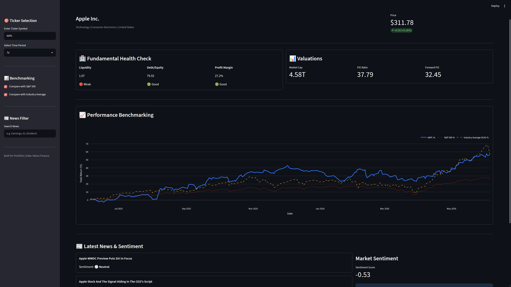

# 💎 Pro Finance Dashboard

An interactive, high-performance finance dashboard built with **Streamlit**, **yfinance**, and **Plotly**. This tool provides real-time stock data, fundamental health checks, and professional-grade benchmarking against the S&P 500 and Industry averages.

 
*(Note: Please replace this placeholder with a real screenshot of your running app!)*

## 🚀 Features

-   **Real-Time Data:** Fetches up-to-the-minute stock prices and company information via Yahoo Finance.
-   **Smart Benchmarking:** 
    -   Compare performance against the **S&P 500**.
    -   **Industry Average:** Automatically maps stocks to their corresponding Sector ETF (e.g., XLK for Tech, XLV for Healthcare) for professional peer comparison.
-   **Fundamental Health Check:** Visual scorecard for Liquidity, Debt-to-Equity, and Profit Margins.
-   **Sentiment Analysis:** Integrated **VADER NLP** engine to analyze headlines and provide a market sentiment score.
-   **News Search:** Filter headlines by ticker relevance or custom keywords.
-   **Clean UI:** Modern, responsive design using Streamlit's native themed components.

## 🛠 Tech Stack

-   **Frontend:** [Streamlit](https://streamlit.io/)
-   **Data Source:** [yfinance](https://github.com/ranaroussi/yfinance)
-   **Visualizations:** [Plotly](https://plotly.com/python/)
-   **NLP:** [vaderSentiment](https://github.com/cjhutto/vaderSentiment)
-   **Environment Management:** [uv](https://github.com/astral-sh/uv)

## 📦 Installation & Setup

Ensure you have [uv](https://github.com/astral-sh/uv) installed, then:

1. **Clone the repository:**
   ```bash
   git clone <your-repo-url>
   cd finance-dashboard
   ```

2. **Run the application:**
   Using `uv`, you don't even need to manually create a venv:
   ```bash
   uv run streamlit run app.py
   ```

   *Alternatively, the traditional way:*
   ```bash
   python -m venv .venv
   source .venv/bin/activate
   pip install -r requirements.txt
   streamlit run app.py
   ```

## 📖 Usage

1. Enter a valid stock ticker (e.g., `AAPL`, `TSLA`, `MSFT`) in the sidebar.
2. Select a time period for performance analysis.
3. Toggle benchmarks in the sidebar to compare against the market or specific industries.
4. Use the News Search to find specific catalysts affecting the stock price.

---
Built for Portfolio | Data provided by Yahoo Finance
